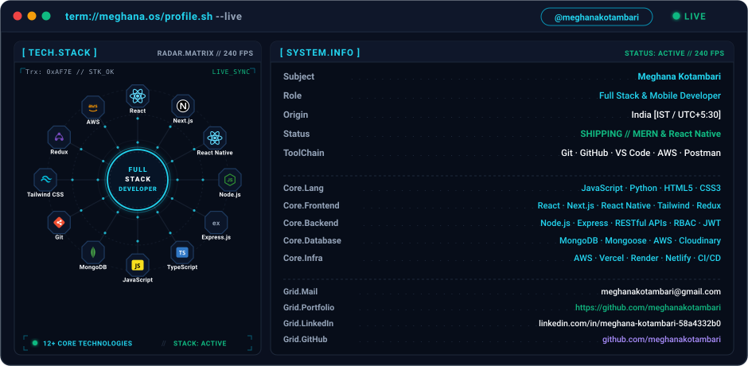

<div align="center">

<!-- ================================================================= -->
<!-- SECTION 1: DUAL-THEME LIVE TERMINAL HERO (profile.sh --live)     -->
<!-- ================================================================= -->

<picture>
  <source media="(prefers-color-scheme: dark)" srcset="assets/dark.svg" />
  <source media="(prefers-color-scheme: light)" srcset="assets/light.svg" />
  
</picture>

</div>

<br/>

<!-- ================================================================= -->
<!-- SECTION 2: IDENTITY & ENGINEERING PHILOSOPHY                     -->
<!-- ================================================================= -->

### ⚡ `ENGINEERING / BUILDING / SHIPPING`

```bash
Full-stack & React Native engineer with 1.5+ years of hands-on production experience 
across 4 industrial internships. Specialized in multi-tenant architectures, AI-assisted 
backends, distributed data pipelines, and offline-capable mobile/web PWAs. 

Driven by strong algorithmic foundations (DSA), high system throughput, and delivering 
robust product-grade software from zero to scale.
```

---

<!-- ================================================================= -->
<!-- SECTION 3: SYSTEM TELEMETRY // ACTIVE THREADS                   -->
<!-- ================================================================= -->

### 📡 `TELEMETRY // ACTIVE_DEPLOYMENTS`

```zsh
$ sys.telemetry --active-context

▸ ACTIVE_ROLE   : Full Stack Developer Intern @ IIIT Dharwad Research Park
▸ CURRENT_BUILD : Sleep-pod booking system with automated payment pipelines (Razorpay) & AWS infra
▸ EXPERIENCE    : 4 Industrial Internships (IIIT Dharwad, Yumaris Agency, ARMB, LettrBlack)
▸ ACADEMICS     : B.E. Computer Science & Engineering // CGPA: 9.00 (Class of 2027)
▸ HACKATHONS    : Winner @ HackToFuture & CodeFiesta 5.0 | Top 10 in 800+ Teams (3x)
▸ CORE_FOCUS    : Multi-tenant SaaS, AI-driven HRMS backends, Cross-Platform Mobile, Offline PWAs
```

---

<!-- ================================================================= -->
<!-- SECTION 4: 4 INDUSTRIAL INTERNSHIPS (CLEAN RESPONSIVE CARDS)     -->
<!-- ================================================================= -->

### 💼 `EXPERIENCE // 4_INDUSTRIAL_INTERNSHIPS`

<details open>
<summary><b>🏢 01 / Full Stack Developer Intern — IIIT Dharwad Research Park</b> &nbsp; <code>July 2026 – Present</code></button></summary>
<br/>

> 📍 **Location:** Dharwad, India *(Hybrid)* &nbsp;|&nbsp; 🏷️ **Domain:** Sleep-Pod Booking Platform & Cloud Infrastructure
>
>       
>
> - ⚡ **Full-Stack Architecture:** Developed complete frontend and backend for a production-ready sleep-pod booking platform with responsive UI, user/booking modules, admin operations, and scalable RESTful APIs.
> - ⚡ **Cloud & Payments:** Integrated Razorpay for secure payments and AWS services for deployment/data handling, ensuring reliable backend services and seamless end-to-end application integration.

</details>

<br/>

<details open>
<summary><b>🤖 02 / Backend Developer Intern — Yumaris Agency</b> &nbsp; <code>Mar 2026 – Sep 2026</code></summary>
<br/>

> 📍 **Location:** Chennai, India *(Remote)* &nbsp;|&nbsp; 🏷️ **Domain:** AI-Powered Enterprise HRMS Backend
>
>      
>
> - ⚡ **Core HR Workflows:** Developed an AI-powered HRMS backend using Node.js, Express.js, and MongoDB, with 25+ REST APIs, JWT/RBAC, and core HR workflows.
> - ⚡ **AI Anomaly & Scoring:** Engineered AI features for anomaly detection, performance analysis, candidate scoring, recommendations, alerts, and analytics, with API optimization and testing.

</details>

<br/>

<details open>
<summary><b>📱 03 / React Native Developer Intern — ARMB</b> &nbsp; <code>Mar 2026 – Sep 2026</code></summary>
<br/>

> 📍 **Location:** West Bengal, India *(Remote)* &nbsp;|&nbsp; 🏷️ **Domain:** On-Demand Local Service Booking Mobile App
>
>      
>
> - ⚡ **Cross-Platform Modules:** Developed core frontend modules for a cross-platform React Native service booking application connecting customers with local service providers (electricians, plumbers, technicians, etc.).
> - ⚡ **Provider Interface:** Engineered the dedicated Service Provider interface, implementing profile management, booking requests handling, real-time availability toggling, and job tracking workflows.
> - ⚡ **Mobile UI/UX:** Built responsive, accessible mobile UI screens with fluid animations, intuitive navigation flows, and robust backend API integrations.

</details>

<br/>

<details open>
<summary><b>🌐 04 / Full Stack Web Developer Intern — LettrBlack</b> &nbsp; <code>Sep 2025 – Feb 2026</code></summary>
<br/>

> 📍 **Location:** Bengaluru, India *(Remote)* &nbsp;|&nbsp; 🏷️ **Domain:** Community Platform & Real-Time Content Hub
>
>     
>
> - ⚡ **Community & Quizzes:** Developed community features and interactive quizzes, increasing engagement by 25% and user interaction by 20% through responsive web experiences.
> - ⚡ **Real-Time News Engine:** Built a real-time News module with dynamic REST API integration and optimized performance, improving content delivery speed by 30% and reducing load time by 25%.
> - ⚡ **Cross-Functional Sync:** Collaborated with backend & UI teams for seamless deployment, state management, and performance optimization.

</details>

---

<!-- ================================================================= -->
<!-- SECTION 5: CAPABILITY MATRIX // TECH STACK                      -->
<!-- ================================================================= -->

### 🛠️ `TECH_STACK // CAPABILITY_MATRIX`

<table>
  <tr>
    <td width="24%" align="right"><b>💻 Languages</b></td>
    <td>
      
      
      
      
    </td>
  </tr>
  <tr>
    <td width="24%" align="right"><b>🎨 Frontend & Mobile</b></td>
    <td>
      
      
      
      
      
      
      
    </td>
  </tr>
  <tr>
    <td width="24%" align="right"><b>⚙️ Backend & Systems</b></td>
    <td>
      
      
      
      
      
      
    </td>
  </tr>
  <tr>
    <td width="24%" align="right"><b>🗄️ Databases & Cloud</b></td>
    <td>
      
      
      
      
    </td>
  </tr>
  <tr>
    <td width="24%" align="right"><b>🛠️ Tools & DevOps</b></td>
    <td>
      
      
      
      
      
      
      
      
    </td>
  </tr>
</table>

---

<!-- ================================================================= -->
<!-- SECTION 6: FEATURED SYSTEMS & PRODUCTION WORK                    -->
<!-- ================================================================= -->

### 🚀 `SELECTED_WORK // PRODUCTION_BUILDS`

<table>
  <tr>
    <!-- Project 01 -->
    <td width="50%" valign="top">
      <h4>🏢 01 / ERPGo — Multi-Tenant Educational ERP</h4>
      <p>
        
        
      </p>
      <p>Enterprise educational ERP platform engineered with 16 integrated modules spanning Academics, HR, Payroll, Finance, Exams, and Hostel operations.</p>
      <ul>
        <li>Implemented strict tenant isolation, role-based access control, and immutable audit logging.</li>
        <li>Engineered automated calculation pipelines for fee collections, payroll, and exam management.</li>
      </ul>
      <p>
        <code>React.js</code> · <code>Node.js</code> · <code>Express.js</code> · <code>MongoDB</code> · <code>JWT</code>
      </p>
      <p>
        <a href="https://github.com/meghanakotambari"><b>Explore System ↗</b></a> &nbsp;|&nbsp; 
        <a href="https://github.com/meghanakotambari"><b>Source Code ↗</b></a>
      </p>
    </td>
    <!-- Project 02 -->
    <td width="50%" valign="top">
      <h4>🎯 02 / GrindLog — Placement Prep PWA Engine</h4>
      <p>
        
        
      </p>
      <p>Mobile-first installable Progressive Web App (PWA) tailored for structured DSA practice, aptitude roadmaps, and 2-user synchronized peer interview prep.</p>
      <ul>
        <li>Built 2-user live interview sparring mode with dynamic topic radar stats and analytics timelines.</li>
        <li>Implemented offline-first service worker caching and background sync for uninterrupted preparation.</li>
      </ul>
      <p>
        <code>MERN Stack</code> · <code>PWA</code> · <code>Tailwind CSS</code> · <code>Service Workers</code>
      </p>
      <p>
        <a href="https://github.com/meghanakotambari"><b>Launch PWA Demo ↗</b></a> &nbsp;|&nbsp; 
        <a href="https://github.com/meghanakotambari"><b>Source Code ↗</b></a>
      </p>
    </td>
  </tr>
  <tr>
    <!-- Project 03 -->
    <td width="50%" valign="top">
      <h4>🍔 03 / OrderMe — Restaurant & Food Hub</h4>
      <p>
        
        
      </p>
      <p>End-to-end food ordering and restaurant management platform with live state tracking, dynamic menu inventory, and dual Dine-in / Parcel flows.</p>
      <ul>
        <li>Integrated Stripe payment gateway with cryptographic webhook validation and automated transactions.</li>
        <li>Constructed real-time operational merchant dashboards, live order tracking, and sales analytics.</li>
      </ul>
      <p>
        <code>MERN Stack</code> · <code>Stripe</code> · <code>Cloudinary</code> · <code>JWT</code> · <code>REST</code>
      </p>
      <p>
        <a href="https://github.com/meghanakotambari"><b>Live Platform ↗</b></a> &nbsp;|&nbsp; 
        <a href="https://github.com/meghanakotambari"><b>Source Code ↗</b></a>
      </p>
    </td>
    <!-- Project 04 -->
    <td width="50%" valign="top">
      <h4>🍲 04 / Ruchio — Food Discovery Mobile App</h4>
      <p>
        
        
      </p>
      <p>Modern cross-platform food discovery mobile application designed to help users explore culinary options through an engaging, intuitive UI.</p>
      <ul>
        <li>Engineered dynamic culinary exploration feeds, smart dish categorization, and personalized favorites.</li>
        <li>Built responsive cross-platform mobile components with fluid native animations and offline caching.</li>
      </ul>
      <p>
        <code>React Native</code> · <code>JavaScript</code> · <code>Redux Toolkit</code> · <code>REST APIs</code>
      </p>
      <p>
        <a href="https://github.com/meghanakotambari"><b>Explore App ↗</b></a> &nbsp;|&nbsp; 
        <a href="https://github.com/meghanakotambari"><b>Source Code ↗</b></a>
      </p>
    </td>
  </tr>
</table>

---

<!-- ================================================================= -->
<!-- SECTION 7: HACKATHON ACHIEVEMENTS & MILESTONES                   -->
<!-- ================================================================= -->

### 🏆 `ACHIEVEMENTS // HACKATHON_RECORDS`

```yaml
hackathon_victories:
  - event: "HackToFuture (Belagavi)"
    result: "WINNER 🏆 (1st Place among 100+ competing engineering teams)"
  - event: "CodeFiesta 5.0 (Gadag)"
    result: "WINNER 🏆 (1st Place among 100+ competing engineering teams)"
  - event: "National Level Hackathons"
    result: "Top 10 Finalist across 800+ teams (Achieved 3x times) & Top 25 in 6+ hackathons"

industrial_milestone:
  - summary: "4 Successful Industrial Engineering Internships completed prior to graduation"
  - companies: "IIIT Dharwad Research Park · Yumaris Agency · ARMB · LettrBlack"
```

---

<!-- ================================================================= -->
<!-- SECTION 8: RESUME SCANNER // DIGITAL CREDENTIALS                -->
<!-- ================================================================= -->

### 📄 `CREDENTIALS // RESUME_SCANNER`

<table>
  <tr>
    <td width="38%" align="center" valign="middle">
      <a href="https://drive.google.com/file/d/1gV66MqHhcaJzJRVpa-82R1VmVX_wMwPq/view?usp=drivesdk" target="_blank">
        
      </a>
    </td>
    <td width="62%" valign="top">
      <h4>⚡ Instant CV Access // PDF Document</h4>
      <p>Point your smartphone camera at the scanner matrix or click below to view the official verified resume on Google Drive.</p>
      <ul>
        <li><b>Current Role:</b> Full Stack Developer Intern @ IIIT Dharwad Research Park</li>
        <li><b>Core Specialization:</b> Full-Stack Web, React Native, AI-Assisted Backends</li>
        <li><b>Education:</b> B.E. Computer Science & Engineering (CGPA: 9.00 // 2027)</li>
        <li><b>Track Record:</b> 4 Industrial Internships (IIIT Dharwad, Yumaris, ARMB, LettrBlack) · 2x Hackathon Winner</li>
      </ul>
      <br/>
      <a href="https://drive.google.com/file/d/1gV66MqHhcaJzJRVpa-82R1VmVX_wMwPq/view?usp=drivesdk" target="_blank">
        
      </a>
    </td>
  </tr>
</table>

---

<!-- ================================================================= -->
<!-- SECTION 9: GITHUB TELEMETRY & METRICS                           -->
<!-- ================================================================= -->

### 📊 `SYSTEM_METRICS // GITHUB_TELEMETRY`

<div align="center">


<br/><br/>


</div>

---

<!-- ================================================================= -->
<!-- SECTION 10: CONTRIBUTION TIMELINE SNAKE                         -->
<!-- ================================================================= -->

### 🐍 `TIMELINE // CONTRIBUTION_STREAM`

<div align="center">

<picture>
  <source media="(prefers-color-scheme: dark)" srcset="https://raw.githubusercontent.com/meghanakotambari/meghanakotambari/output/github-snake-dark.svg" />
  <source media="(prefers-color-scheme: light)" srcset="https://raw.githubusercontent.com/meghanakotambari/meghanakotambari/output/github-snake.svg" />
  
</picture>

</div>

---

<!-- ================================================================= -->
<!-- SECTION 11: COMMUNICATION LINKS & CONTACT MATRIX                -->
<!-- ================================================================= -->

### 🌐 `COMM_LINK // CONNECT`

<div align="center">

<a href="https://www.linkedin.com/in/meghana-kotambari-58a4332b0/">
  
</a>
&nbsp;
<a href="mailto:meghanakotambari@gmail.com">
  
</a>
&nbsp;
<a href="https://github.com/meghanakotambari">
  
</a>

<br/><br/>

```
[SYS_DISPATCH]: Open for full-time software engineering roles, high-impact product teams, and technical collaborations.
```

</div>
